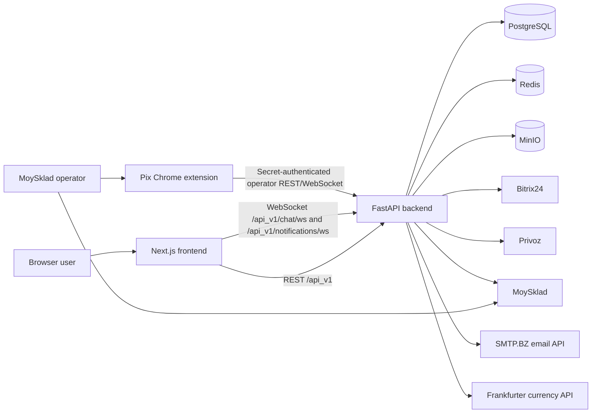
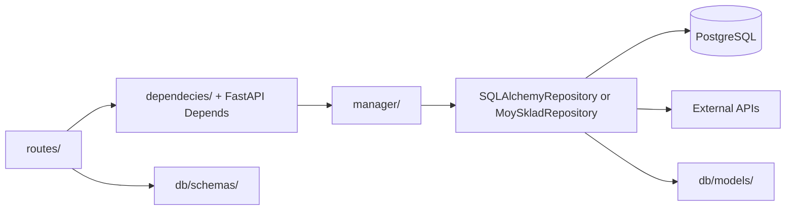

# Pix Logistic Architecture

## System context

The product is split across two adjacent repositories. `pix_frontend_v2` is a Next.js 14 browser application; this repository is the FastAPI API and integration service. The browser never receives backend secrets. Its `NEXT_PUBLIC_BACKEND_URL` is a public build-time value.

## Request and dependency flow

1. `main.create_app()` creates the API router under `/api_v1`, middleware, error mapping, Redis cache backend, and optional scheduler.
2. Route modules validate transport data and obtain the current user and managers through FastAPI dependencies.
3. Managers implement order, address, payment, user, order-chat, notification, and organization use cases. `OrderCreationManager` coordinates address validation, product and customer-order creation, and last-use preference.
4. Repositories talk to PostgreSQL or an external API. External credentials are resolved at call time through `config.Settings`.
5. `IntegrationNotConfigured` is mapped to HTTP 503 with no credential details.

The existing directory is named `dependecies/`; its spelling is part of current imports.

## Mounted route groups

All paths below are relative to `/api_v1`.

| Group | Main paths | Responsibility | Typical dependencies |
| --- | --- | --- | --- |
| Health/compatibility | `/health`, `/`, `/hello/{name}` | Liveness and legacy sample routes | None |
| Users/auth | `/users/auth/*`, `/users/users/*`, `/users/updatedMe`, `/users/operations` | FastAPI Users JWT, email verification/reset, profile and MoySklad balance | Redis token strategy, PostgreSQL, MoySklad, email |
| Orders | `/orders`, `/orders/{id}`, `/orders/{id}/changes`, `/orders/state/{id}`, `/orders/*/export/*`, `/orders/file` | Create/read/update/cancel orders, require delivery address at checkout, positions, exports, spreadsheet preview | PostgreSQL addresses, MoySklad, Privoz, pandas |
| Addresses | `/addresses` GET/POST, `/addresses/{id}` PATCH/DELETE | User-owned address-book CRUD, case-insensitive title search, pagination, and last-used default | PostgreSQL |
| Payments | `/payment`, `/payment/vault_courses` | MoySklad payments and cached exchange rates | MoySklad, Redis, Frankfurter |
| Organizations | `/organizations/*` | Owners, organization users, aggregate orders | PostgreSQL, MoySklad, Privoz |
| Notifications | `/notifications/`, `/notifications/unread-count`, `/notifications/read*`, `/notifications/ws` | Create, enrich, list, mark `ORDER_UPDATED`/`ORDER_MESSAGE` notifications, and stream each user's absolute unread count | PostgreSQL, Redis pub/sub, MoySklad, order chat |
| Customer order chat | `/chat/ws`, `/chat/orders/{order_id}/messages`, `/chat/attachments/{id}` | Immutable customer-order chat, files, pagination, and owner-scoped real-time delivery | Redis JWT/pub/sub, PostgreSQL, MinIO, MoySklad |
| Operator order chat | `/chat/operator/ws`, `/chat/operator/orders/{order_id}/messages`, `/chat/operator/orders/{order_id}/attachments/{id}` | Chrome-extension history, manager sends/downloads, shared-secret authentication, and linked-order verification | Extension secret, Redis pub/sub, PostgreSQL, MinIO, MoySklad |
| Integrations | `/integration/bitrix/*`, `/integration/orders/*`, `/integration/webhooks/*`, `/integration/vaults/*` | Bitrix CRUD, service callbacks, order/invoice webhooks, rate feed | Bitrix, MoySklad, PostgreSQL, external HTTP |

`routes/invoices.py` exists but is not mounted by `main.py` or the integration router. Treat unmounted route modules as inactive until wiring and tests are added.

## Data and state

| Store/model | Purpose |
| --- | --- |
| PostgreSQL `user` | FastAPI Users identity plus balance, organization, MoySklad, and Bitrix references |
| `address` | Unlimited user-owned delivery addresses, normalized unique titles, structured address fields, and `last_used_at` preference |
| `organization` | Owner-linked organization boundary |
| `order`, `order_items`, `order_actions` | Local order metadata, positions, and state history; most live order data is read from MoySklad |
| `transaction` | User balance changes |
| `notifications` | Unread/read `ORDER_UPDATED` and `ORDER_MESSAGE` events referencing external orders or retained order-chat messages |
| `order_chat_message`, `order_chat_attachment` | Append-only canonical order history and MinIO object metadata; PostgreSQL triggers reject updates and deletes |
| `order_chat_state` | Durable order-to-client room ownership established after a fresh MoySklad order lookup |
| `moysklad_order_file`, `chat_outbox_event` | Retained historical projection schema; no active runtime reads or writes it, and later removal is a separate destructive operation |
| `privoz_order` | Scraped Privoz order number and state cache |
| Redis | JWT token strategy, verification/reset code mapping, FastAPI cache, hourly currency-rate cache, multi-worker chat pub/sub, and per-user unread-notification count pub/sub |
| MinIO `pix-order-chat` bucket | Canonical bytes for site and MoySklad order-chat attachments |

SQLAlchemy models are imported through the application graph rather than a single model registry. Alembic migrations are the schema history and must be reviewed manually.

## External integrations

| Integration | Used for | Configuration behavior |
| --- | --- | --- |
| MoySklad | Counterparties, products, customer orders, invoices, payments, exports, reports, and fresh order/client verification for both chat transports | Credentials resolved lazily; central to order flows; chat messages/files are not projected into MoySklad |
| Bitrix24 | Contacts, deals, products and deal product rows | Webhook base URL required when called |
| Privoz | Login, scrape order states, sync local cache | Username/password required before an HTTP session starts |
| SMTP.BZ | Verification and password-reset messages | Token required before send |
| Frankfurter | PLN to USD/EUR rates | Response cached in Redis for one hour |

External calls currently use synchronous `requests` in async request paths. They have limited timeout/retry/error normalization and can block the event loop.

## REST, WebSocket, and scheduled flows

The JWT login endpoint stores bearer-token state through the Redis strategy. Protected REST routes resolve `current_user_dependency`. Verification/reset handlers store short-lived code-to-token mappings in Redis before sending email.

Email verification commits the local identity state independently of external
integrations. An unlinked verified user then searches MoySklad counterparties
by common exact representations of the normalized phone number. The backend
normalizes returned candidates again: one match is linked without modifying the
counterparty, while zero or multiple matches create a new counterparty. Lookup
errors never fall back to creation and are logged without turning successful
email verification into a client error. `GET /users/updatedMe` retries a missing
link for already verified users and returns the local user when MoySklad remains
unavailable; its balance refresh is also best-effort so authentication stays
available. The local MoySklad `id` and `meta` are persisted without constructing
or awaiting a side-notification client.

Checkout `POST /api_v1/orders` requires `address_id`, at least one valid item,
and a UUID `Idempotency-Key`. The browser persists one key for a logical
checkout attempt and reuses it after an uncertain response; changing the
address or cart starts a new attempt. The backend scopes the key to the user,
serializes it through Redis, rejects changed payloads for an existing key, and
replays the completed order response. Deterministic MoySklad `syncId` values
make generated products and the customer order safe to recreate after a
worker interruption. Only the owning request updates the last-used address.
Completed replay records remain in
Redis for 24 hours, which is the bounded API replay and conflict window.

The backend resolves the address with both its ID and the authenticated user ID before any external request, creates an immutable address snapshot, and copies it into the MoySklad customer order as `shipmentAddress` and `shipmentAddressFull`. `shipmentAddressFull.comment` remains reserved for the existing Privoz `#` marker; the courier note is written to `addInfo`. The address becomes the default only when MoySklad order creation succeeds and `last_used_at` is updated. Address-preference failure does not turn an already-created external order into a retryable checkout failure.

The frontend reuses one address-book component for checkout and `/dashboard/addresses`. It supports create, edit, delete, case-insensitive title search, explicit selection, server-derived default selection, and a guarded single-submit checkout flow that preserves the cart on failure.

Authenticated order-document export endpoints proxy MoySklad print requests and
return only verified PDF attachments. Customer orders and outgoing invoices
must belong to the current user's MoySklad counterparty; purchase-order exports
are restricted to superusers, and authorization failures are hidden as 404s.
Document-context, template, and print requests all have bounded timeouts.
Temporary MoySklad download URLs stay on the server, while upstream timeouts,
HTTP errors, incomplete responses, and invalid content are reduced to a safe
`502 document_export_failed` response. Successful financial-document responses
use `Cache-Control: private, no-store`.

Customer edits are staged in the browser and saved through
`PUT /api_v1/orders/{id}/changes`. The backend accepts edits only in
`Подтвержден менеджером`, `Ожидает подтверждения клиента`,
`Подтвержден клиентом`, or `Изменен клиентом`, verifies the owner and
`expected_updated`, then replaces positions and sets `Изменен клиентом` in one
MoySklad order update. The successful response contains only the updated order
and whether a change was made.

For website WebSocket chat, the client opens `/api_v1/chat/ws` with mandatory `auth` and `room` query parameters. The room must be a UUID for an order the current user owns; missing room closes with `4400`, authentication failure with `4401`, and an invalid or inaccessible room with `4404`. Connections remain local to each worker, while Redis pub/sub fans persisted order messages out to every worker and browser tab. Sockets are outbound-only; clients create order messages and files through authenticated REST. There is no general-support room.

The Chrome extension opens `/api_v1/chat/operator/ws?room={order_id}` and sends the shared extension secret in the first JSON frame; the secret never belongs in a URL. Operator REST sends it only as `X-Pix-Chat-Secret`. After authentication, both transports resolve the current MoySklad order and its counterparty, require a linked Pix user, and use the same PostgreSQL room, MinIO objects, Redis fanout, validation, pagination, and immutable response model. Operator WebSocket sends are rejected; manager messages and files use operator REST. A bad secret is `401`/`4401`, an unlinked or inaccessible order is `404`/`4404`, and a temporarily unavailable MoySklad lookup is `503`.

For notification counters, the dashboard first reads `GET /api_v1/notifications/unread-count`, then subscribes to `/api_v1/notifications/ws?auth=...`. The server publishes an absolute `{type: "notification_count", unread_count: N, version: V}` snapshot on a user-scoped Redis channel after a notification is committed or marked read. A mandatory per-user Redis lock with a bounded critical section serializes each count query with its publication; the initial WebSocket snapshot uses the same pub/sub path. Redis increments a per-user version, and the browser discards older versions, so queued snapshots cannot overwrite newer values across workers. If the lock or Redis is unavailable, the database mutation and REST count still succeed but no unordered realtime event is emitted. The public create route requires authentication and forces the recipient to the current user; trusted integrations create notifications through the manager layer. Hovering or clicking an unread row marks only that user's notification as read; `POST /api_v1/notifications/read` performs one bulk update for all of that user's unread notifications. The browser serializes local read mutations, applies optimistic counter changes, rejects delayed REST snapshots after newer local/WebSocket state, and reconciles on responses, focus, or reconnect.

Order chat has one canonical history and two transports. A website client send verifies order ownership, stores an immutable PostgreSQL message plus MinIO objects, and publishes the persisted response through Redis. A Chrome-extension manager send verifies the current MoySklad order/counterparty link, stores source/origin `extension`, creates the website `ORDER_MESSAGE` notification in the same transaction, and publishes the same response shape to site and operator sockets. REST history and POST responses are merged with WebSocket events by immutable message ID. There is no active description/file projection, order-chat webhook, outbox worker, reply marker, or MoySklad chat-file ingestion runtime. Historical comments/files already rendered in MoySklad remain external historical data; PostgreSQL and MinIO are canonical for all new chat activity.

When `ENABLE_SCHEDULER=true`, the FastAPI lifespan starts APScheduler with an hourly `change_states_on_moysklad` job. The job scrapes Privoz, reads MoySklad orders/purchases, updates states, and writes website `ORDER_UPDATED` notifications. Local default is false because this flow contacts production services.

## Deployment topology

The production Compose file describes PostgreSQL, source-built pinned MinIO, a prebuilt frontend image, backend image, and pgAdmin. NGINX configuration proxies `/` to frontend, `/api_v1/` and WebSocket upgrades to backend, keeps the existing customer chat routes, and gives operator REST and WebSocket exact rate-limit zones. Operator REST has a `205m` request cap for ten 20 MiB attachments plus multipart overhead; the exact operator WebSocket location has upgrade headers and no upload allowance. The legacy order-chat webhook prefix remains access-log-suppressed only for rollback compatibility until its separately approved cleanup. TLS files are mounted outside the repository.

GitHub Actions deploys pushes to `main` over SSH, pulls on the server, builds
the backend image, runs the sanitized base production preflight, validates
Compose, builds pinned MinIO and updates services through `docker-compose up
-d`. The automatic path does not run Alembic, stop the whole Compose project,
prune Docker data or register webhooks. Those production mutations remain
separate approved operator steps.

## Current technical debt

- Many async endpoints call blocking `requests`; network clients lack common timeouts, retry policy, and typed error translation.
- The repository abstraction mixes PostgreSQL with a SQLite-specific upsert implementation.
- The destructive schema-removal revision has disposable-schema PostgreSQL tests; older migrations still rely mostly on static review.
- Scheduler code is named `celery_worker.py`, writes a diagnostic `test.json`, and catches broad exceptions with `print`.
- WebSocket connection objects are process-local by design; Redis pub/sub is therefore required for multi-worker order-chat fanout.
- Several integration endpoints have no explicit user dependency; review authorization before exposing new deployment routes.
- Historical compiled `.pyc` files remain tracked even though new generated files are ignored.
- Frontend currently reports React hook warnings and npm audit findings; see its README.
