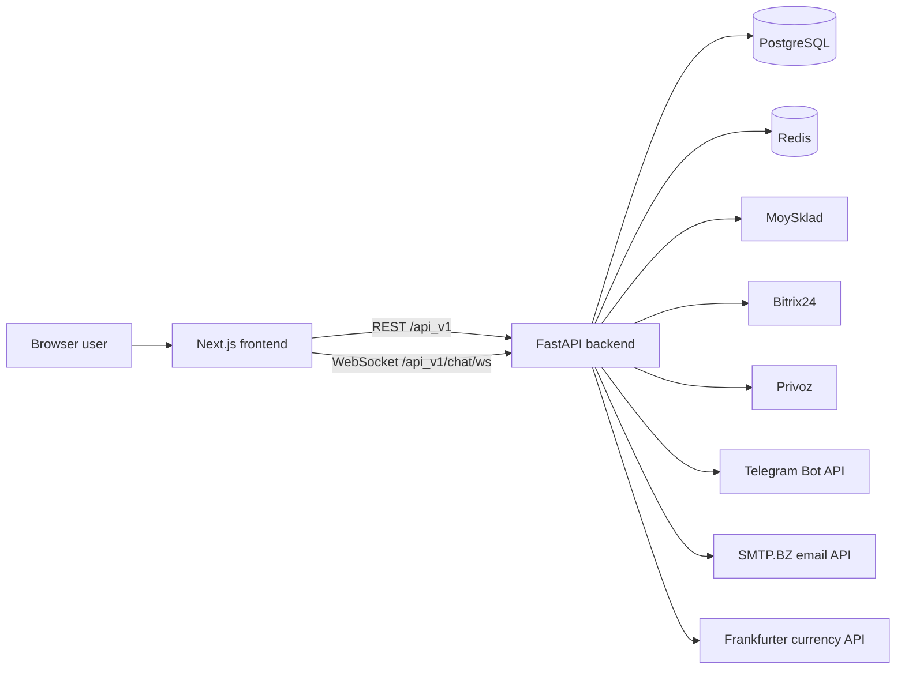
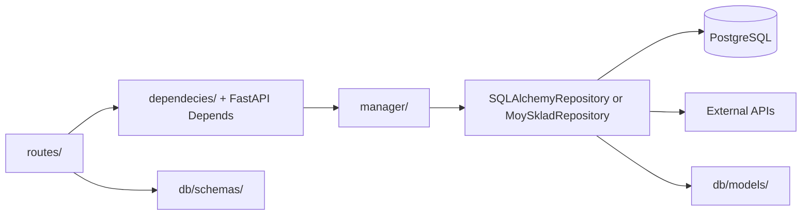

# Pix Logistic Architecture

## System context

The product is split across two adjacent repositories. `pix_frontend_v2` is a Next.js 14 browser application; this repository is the FastAPI API and integration service. The browser never receives backend secrets. Its `NEXT_PUBLIC_BACKEND_URL` is a public build-time value.

## Request and dependency flow

1. `main.create_app()` creates the API router under `/api_v1`, middleware, error mapping, Redis cache backend, and optional scheduler.
2. Route modules validate transport data and obtain the current user and managers through FastAPI dependencies.
3. Managers implement order, payment, user, chat, notification, and organization use cases.
4. Repositories talk to PostgreSQL or an external API. External credentials are resolved at call time through `config.Settings`.
5. `IntegrationNotConfigured` is mapped to HTTP 503 with no credential details.

The existing directory is named `dependecies/`; its spelling is part of current imports.

## Mounted route groups

All paths below are relative to `/api_v1`.

| Group | Main paths | Responsibility | Typical dependencies |
| --- | --- | --- | --- |
| Health/compatibility | `/health`, `/`, `/hello/{name}` | Liveness and legacy sample routes | None |
| Users/auth | `/users/auth/*`, `/users/users/*`, `/users/updatedMe`, `/users/operations`, `/users/telegram/{id}` | FastAPI Users JWT, verification/reset, profile and MoySklad balance | Redis token strategy, PostgreSQL, MoySklad, Telegram/email |
| Orders | `/orders`, `/orders/{id}`, `/orders/{id}/changes`, `/orders/state/{id}`, `/orders/*/export/*`, `/orders/file` | Create/read/update/cancel orders, positions, exports, spreadsheet preview | MoySklad, Privoz, Telegram, pandas |
| Payments | `/payment`, `/payment/vault_courses` | MoySklad payments and cached exchange rates | MoySklad, Redis, Frankfurter |
| Organizations | `/organizations/*` | Owners, organization users, aggregate orders | PostgreSQL, MoySklad, Privoz |
| Notifications | `/notifications/*` | Create, enrich, list, and mark notifications | PostgreSQL, MoySklad, chat |
| Chat | `/chat/ws`, `/chat/messages*`, `/chat/{order_id}` | Authenticated real-time and REST support chat | Redis JWT, PostgreSQL, Telegram |
| Bot | `/bot/accept_transaction` | Notify configured Telegram group about a transaction | Telegram |
| Integrations | `/integration/bitrix/*`, `/integration/orders/*`, `/integration/webhooks/*`, `/integration/vaults/*` | Bitrix CRUD, service callbacks, order/invoice webhooks, rate feed | Bitrix, MoySklad, PostgreSQL, external HTTP |

`routes/invoices.py` exists but is not mounted by `main.py` or the integration router. Treat unmounted route modules as inactive until wiring and tests are added.

## Data and state

| Store/model | Purpose |
| --- | --- |
| PostgreSQL `user` | FastAPI Users identity plus balance, organization, MoySklad, Bitrix, and Telegram references |
| `organization` | Owner-linked organization boundary |
| `order`, `order_items`, `order_actions` | Local order metadata, positions, and state history; most live order data is read from MoySklad |
| `transaction` | User balance changes |
| `notifications` | Unread/read events referencing messages or external orders |
| `message`, `chat_room` | Support messages, members, client/order rooms |
| `privoz_order` | Scraped Privoz order number and state cache |
| Redis | JWT token strategy, verification/reset code mapping, FastAPI cache backend, and hourly currency-rate cache |

SQLAlchemy models are imported through the application graph rather than a single model registry. Alembic migrations are the schema history and must be reviewed manually.

## External integrations

| Integration | Used for | Configuration behavior |
| --- | --- | --- |
| MoySklad | Counterparties, products, customer orders, invoices, payments, exports, reports | Credentials resolved lazily; central to order flows |
| Bitrix24 | Contacts, deals, products and deal product rows | Webhook base URL required when called |
| Privoz | Login, scrape order states, sync local cache | Username/password required before an HTTP session starts |
| Telegram | Group, support, and user notifications | Bot is constructed only before the first send |
| SMTP.BZ | Verification and password-reset messages | Token required before send |
| Frankfurter | PLN to USD/EUR rates | Response cached in Redis for one hour |

External calls currently use synchronous `requests` in async request paths. They have limited timeout/retry/error normalization and can block the event loop.

## REST, WebSocket, and scheduled flows

The JWT login endpoint stores bearer-token state through the Redis strategy. Protected REST routes resolve `current_user_dependency`. Verification/reset handlers store short-lived code-to-token mappings in Redis before sending email.

Customer edits are staged in the browser and saved through
`PUT /api_v1/orders/{id}/changes`. The backend accepts edits only in
`Подтвержден менеджером`, `Ожидает подтверждения клиента`,
`Подтвержден клиентом`, or `Изменен клиентом`, verifies the owner and
`expected_updated`, then replaces positions and sets `Изменен клиентом` in one
MoySklad order update. Telegram is attempted after the save; a notification
failure is reported separately and does not invite the client to resubmit the
order mutation.

For WebSocket chat, the client opens `/api_v1/chat/ws` with `auth` and optional `room` query parameters. The backend validates the token through Redis, associates the socket with an in-memory room in `ChatManager`, persists messages, and can create notifications or Telegram alerts. This in-memory connection registry is process-local; multi-worker scaling needs a shared pub/sub layer.

When `ENABLE_SCHEDULER=true`, the FastAPI lifespan starts APScheduler with an hourly `change_states_on_moysklad` job. The job scrapes Privoz, reads MoySklad orders/purchases, updates states, writes notifications, and may send Telegram messages. Local default is false because this flow contacts production services.

## Deployment topology

The production Compose file describes PostgreSQL, a prebuilt frontend image, backend image, pgAdmin, and bot. NGINX configuration proxies `/` to frontend, `/api_v1/` and WebSocket upgrades to backend, and `/pgadmin/` to pgAdmin. TLS files are mounted outside the repository.

GitHub Actions deploys pushes to `main` over SSH, pulls on the server, builds the backend image, runs Alembic, restarts Compose, and prunes Docker data. This pipeline is deployment automation, not a local-development command; migration and prune behavior require production review.

## Current technical debt

- Many async endpoints call blocking `requests`; network clients lack common timeouts, retry policy, and typed error translation.
- The repository abstraction mixes PostgreSQL with a SQLite-specific upsert implementation.
- Database behavior and Alembic migrations do not yet have integration tests.
- SQLAlchemy uses deprecated `as_scalar()` in chat model properties.
- Scheduler code is named `celery_worker.py`, writes a diagnostic `test.json`, and catches broad exceptions with `print`.
- Chat connection state is process-local, and authorization checks around rooms/manager-only messaging need dedicated security tests.
- Several integration endpoints have no explicit user dependency; review authorization before exposing new deployment routes.
- Historical compiled `.pyc` files remain tracked even though new generated files are ignored.
- Frontend currently reports React hook warnings and npm audit findings; see its README.
