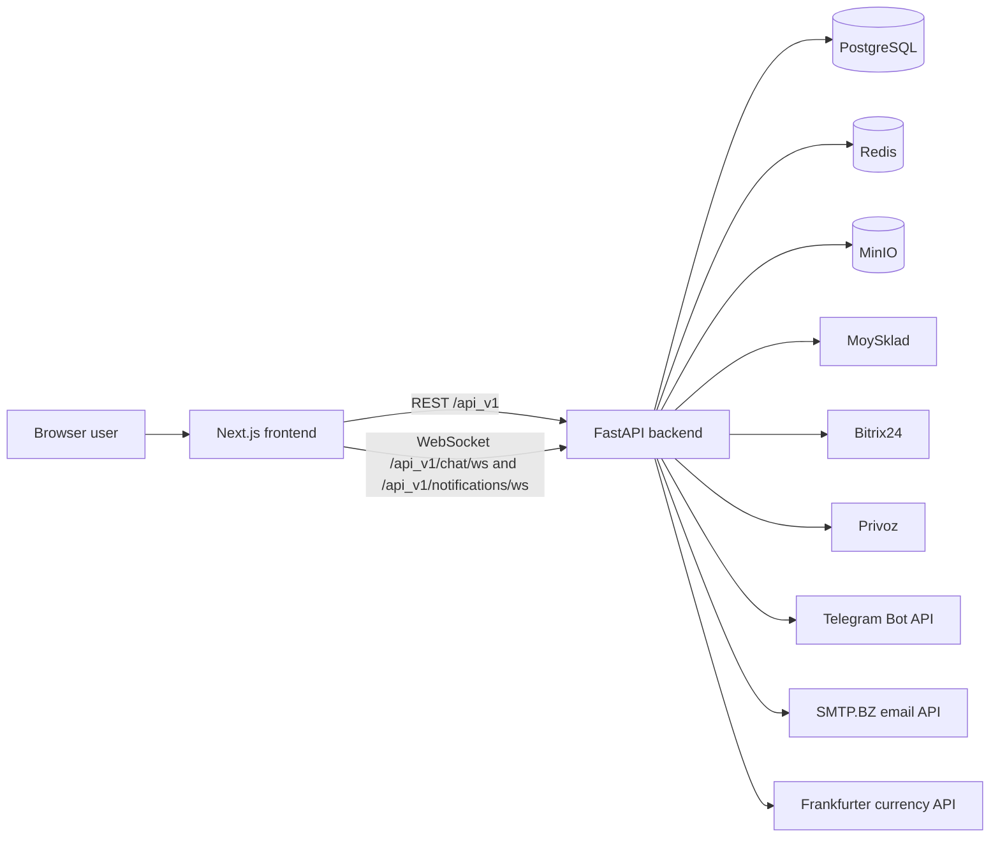
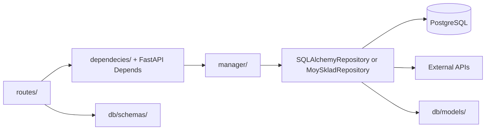

# Pix Logistic Architecture

## System context

The product is split across two adjacent repositories. `pix_frontend_v2` is a Next.js 14 browser application; this repository is the FastAPI API and integration service. The browser never receives backend secrets. Its `NEXT_PUBLIC_BACKEND_URL` is a public build-time value.

## Request and dependency flow

1. `main.create_app()` creates the API router under `/api_v1`, middleware, error mapping, Redis cache backend, and optional scheduler.
2. Route modules validate transport data and obtain the current user and managers through FastAPI dependencies.
3. Managers implement order, address, payment, user, chat, notification, and organization use cases. `OrderCreationManager` coordinates address validation, product and customer-order creation, last-use preference, and notification.
4. Repositories talk to PostgreSQL or an external API. External credentials are resolved at call time through `config.Settings`.
5. `IntegrationNotConfigured` is mapped to HTTP 503 with no credential details.

The existing directory is named `dependecies/`; its spelling is part of current imports.

## Mounted route groups

All paths below are relative to `/api_v1`.

| Group | Main paths | Responsibility | Typical dependencies |
| --- | --- | --- | --- |
| Health/compatibility | `/health`, `/`, `/hello/{name}` | Liveness and legacy sample routes | None |
| Users/auth | `/users/auth/*`, `/users/users/*`, `/users/updatedMe`, `/users/operations`, `/users/telegram/{id}` | FastAPI Users JWT, verification/reset, profile and MoySklad balance | Redis token strategy, PostgreSQL, MoySklad, Telegram/email |
| Orders | `/orders`, `/orders/{id}`, `/orders/{id}/changes`, `/orders/state/{id}`, `/orders/*/export/*`, `/orders/file` | Create/read/update/cancel orders, require delivery address at checkout, positions, exports, spreadsheet preview | PostgreSQL addresses, MoySklad, Privoz, Telegram, pandas |
| Addresses | `/addresses` GET/POST, `/addresses/{id}` PATCH/DELETE | User-owned address-book CRUD, case-insensitive title search, pagination, and last-used default | PostgreSQL |
| Payments | `/payment`, `/payment/vault_courses` | MoySklad payments and cached exchange rates | MoySklad, Redis, Frankfurter |
| Organizations | `/organizations/*` | Owners, organization users, aggregate orders | PostgreSQL, MoySklad, Privoz |
| Notifications | `/notifications/`, `/notifications/unread-count`, `/notifications/read*`, `/notifications/ws` | Create, enrich, list, mark notifications, and stream each user's absolute unread count | PostgreSQL, Redis pub/sub, MoySklad, chat |
| Chat | `/chat/ws`, `/chat/messages*`, `/chat/orders/{order_id}/messages`, `/chat/attachments/{id}` | General support plus immutable customer-order chat, files, pagination, and real-time delivery | Redis JWT/pub-sub, PostgreSQL, MinIO, MoySklad, Telegram |
| Bot | `/bot/accept_transaction` | Notify configured Telegram group about a transaction | Telegram |
| Integrations | `/integration/bitrix/*`, `/integration/orders/*`, `/integration/webhooks/*`, `/integration/webhooks/order-chat/{secret}`, `/integration/vaults/*` | Bitrix CRUD, service callbacks, order/invoice/order-chat webhooks, rate feed | Bitrix, MoySklad, PostgreSQL, external HTTP |

`routes/invoices.py` exists but is not mounted by `main.py` or the integration router. Treat unmounted route modules as inactive until wiring and tests are added.

## Data and state

| Store/model | Purpose |
| --- | --- |
| PostgreSQL `user` | FastAPI Users identity plus balance, organization, MoySklad, Bitrix, and Telegram references |
| `address` | Unlimited user-owned delivery addresses, normalized unique titles, structured address fields, and `last_used_at` preference |
| `organization` | Owner-linked organization boundary |
| `order`, `order_items`, `order_actions` | Local order metadata, positions, and state history; most live order data is read from MoySklad |
| `transaction` | User balance changes |
| `notifications` | Unread/read events referencing messages or external orders |
| `message`, `chat_room` | Support messages, members, client/order rooms |
| `order_chat_message`, `order_chat_attachment` | Append-only canonical order history and MinIO object metadata; PostgreSQL triggers reject updates and deletes |
| `order_chat_state`, `moysklad_order_file` | Last observed MoySklad projection and deduplicated remote file observations |
| `chat_outbox_event` | Transactional delivery work, retry state, webhook deduplication, and Telegram side notifications |
| `privoz_order` | Scraped Privoz order number and state cache |
| Redis | JWT token strategy, verification/reset code mapping, FastAPI cache, hourly currency-rate cache, multi-worker chat pub/sub, and per-user unread-notification count pub/sub |
| MinIO `pix-order-chat` bucket | Canonical bytes for site and MoySklad order-chat attachments |

SQLAlchemy models are imported through the application graph rather than a single model registry. Alembic migrations are the schema history and must be reviewed manually.

## External integrations

| Integration | Used for | Configuration behavior |
| --- | --- | --- |
| MoySklad | Counterparties, products, customer orders, invoices, payments, exports, reports, and the operator-facing order-chat projection | Credentials resolved lazily; central to order flows |
| Bitrix24 | Contacts, deals, products and deal product rows | Webhook base URL required when called |
| Privoz | Login, scrape order states, sync local cache | Username/password required before an HTTP session starts |
| Telegram | Group, support, and user notifications | Bot is constructed only before the first send |
| SMTP.BZ | Verification and password-reset messages | Token required before send |
| Frankfurter | PLN to USD/EUR rates | Response cached in Redis for one hour |

External calls currently use synchronous `requests` in async request paths. They have limited timeout/retry/error normalization and can block the event loop.

## REST, WebSocket, and scheduled flows

The JWT login endpoint stores bearer-token state through the Redis strategy. Protected REST routes resolve `current_user_dependency`. Verification/reset handlers store short-lived code-to-token mappings in Redis before sending email.

After email verification, an unlinked user searches MoySklad counterparties by
common exact representations of the normalized phone number. The backend
normalizes returned candidates again: one match is linked without modifying the
counterparty, while zero or multiple matches create a new counterparty. Lookup
errors never fall back to creation. The local `id` and `meta` are persisted
before the Telegram side notification is attempted.

Checkout `POST /api_v1/orders` requires `address_id`, at least one valid item,
and a UUID `Idempotency-Key`. The browser persists one key for a logical
checkout attempt and reuses it after an uncertain response; changing the
address or cart starts a new attempt. The backend scopes the key to the user,
serializes it through Redis, rejects changed payloads for an existing key, and
replays the completed order response. Deterministic MoySklad `syncId` values
make generated products and the customer order safe to recreate after a
worker interruption. Only the owning request updates the last-used address
and attempts the Telegram notification. Completed replay records remain in
Redis for 24 hours, which is the bounded API replay and conflict window.

The backend resolves the address with both its ID and the authenticated user ID before any external request, creates an immutable address snapshot, and copies it into the MoySklad customer order as `shipmentAddress` and `shipmentAddressFull`. `shipmentAddressFull.comment` remains reserved for the existing Privoz `#` marker; the courier note is written to `addInfo`. The address becomes the default only when MoySklad order creation succeeds and `last_used_at` is updated. Address preference and Telegram notification failures do not turn an already-created external order into a retryable checkout failure.

The frontend reuses one address-book component for checkout and `/dashboard/addresses`. It supports create, edit, delete, case-insensitive title search, explicit selection, server-derived default selection, and a guarded single-submit checkout flow that preserves the cart on failure.

Customer edits are staged in the browser and saved through
`PUT /api_v1/orders/{id}/changes`. The backend accepts edits only in
`Подтвержден менеджером`, `Ожидает подтверждения клиента`,
`Подтвержден клиентом`, or `Изменен клиентом`, verifies the owner and
`expected_updated`, then replaces positions and sets `Изменен клиентом` in one
MoySklad order update. Telegram is attempted after the save; a notification
failure is reported separately and does not invite the client to resubmit the
order mutation.

For WebSocket chat, the client opens `/api_v1/chat/ws` with `auth` and optional `room` query parameters. The backend validates the token through Redis and performs a fresh MoySklad owner check for order rooms. Connections remain local to each worker, while Redis pub/sub fans persisted order messages and durable delivery-state events out to every worker and browser tab. Order-room sockets are outbound-only; clients create order messages and files through authenticated REST. The existing general-support room remains bidirectional and otherwise unchanged.

For notification counters, the dashboard first reads `GET /api_v1/notifications/unread-count`, then subscribes to `/api_v1/notifications/ws?auth=...`. The server publishes an absolute `{type: "notification_count", unread_count: N, version: V}` snapshot on a user-scoped Redis channel after a notification is committed or marked read. A mandatory per-user Redis lock with a bounded critical section serializes each count query with its publication; the initial WebSocket snapshot uses the same pub/sub path. Redis increments a per-user version, and the browser discards older versions, so queued snapshots cannot overwrite newer values across workers. If the lock or Redis is unavailable, the database mutation and REST count still succeed but no unordered realtime event is emitted. The public create route requires authentication and forces the recipient to the current user; trusted integrations create notifications through the manager layer. Hovering or clicking an unread row marks only that user's notification as read; `POST /api_v1/notifications/read` performs one bulk update for all of that user's unread notifications. The browser serializes local read mutations, applies optimistic counter changes, rejects delayed REST snapshots after newer local/WebSocket state, and reconciles on responses, focus, or reconnect.

Order chat has two durable flows. From the site, the backend verifies current order ownership, stores an immutable PostgreSQL message and MinIO objects in one use case, and commits an outbox event. The worker projects the bounded transcript into the standard MoySklad customer-order `description`, uploads client mirror/history files, and sends a Telegram group alert. From MoySklad, the fast secret-path webhook commits inbound work, then a worker parses text below the reply marker and only files prefixed `[КЛИЕНТ]`, rechecks the owner, stores new immutable history/MinIO objects, and publishes through Redis/WebSocket to the site. A client Telegram alert is a side notification. Internal manager files stay hidden. MoySklad is an operator projection; PostgreSQL and MinIO are canonical history.

When `ENABLE_SCHEDULER=true`, the FastAPI lifespan starts APScheduler with an hourly `change_states_on_moysklad` job. The job scrapes Privoz, reads MoySklad orders/purchases, updates states, writes notifications, and may send Telegram messages. Local default is false because this flow contacts production services.

## Deployment topology

The production Compose file describes PostgreSQL, source-built pinned MinIO, a prebuilt frontend image, backend image, pgAdmin, and bot. NGINX configuration proxies `/` to frontend, `/api_v1/` and WebSocket upgrades to backend, applies a `205m` cap only to order-chat uploads, disables access logging for the secret webhook path, and proxies `/pgadmin/` to pgAdmin. TLS files are mounted outside the repository.

GitHub Actions deploys pushes to `main` over SSH, pulls on the server, builds
the backend image, runs the sanitized base production preflight, validates
Compose, builds pinned MinIO and updates services through `docker-compose up
-d`. The automatic path does not run Alembic, stop the whole Compose project,
prune Docker data or register webhooks. Those production mutations remain
separate approved operator steps.

## Current technical debt

- Many async endpoints call blocking `requests`; network clients lack common timeouts, retry policy, and typed error translation.
- The repository abstraction mixes PostgreSQL with a SQLite-specific upsert implementation.
- Database behavior and Alembic migrations do not yet have integration tests.
- SQLAlchemy uses deprecated `as_scalar()` in chat model properties.
- Scheduler code is named `celery_worker.py`, writes a diagnostic `test.json`, and catches broad exceptions with `print`.
- WebSocket connection objects are process-local by design; Redis pub/sub is therefore required for multi-worker order-chat fanout.
- Several integration endpoints have no explicit user dependency; review authorization before exposing new deployment routes.
- Historical compiled `.pyc` files remain tracked even though new generated files are ignored.
- Frontend currently reports React hook warnings and npm audit findings; see its README.
